# EMBERWAKE

[](https://github.com/AieatAssam/emberwake/actions/workflows/ci.yml)
[](https://github.com/AieatAssam/emberwake/actions/workflows/deploy.yml)

**The sun is dead. You carry the last Ember.** Burn brighter than the Gloam — or be swallowed by it.

Emberwake is a browser **bullet-heaven survival roguelite** in the vein of *Vampire Survivors*, built with **PixiJS v8** (WebGL, batched `ParticleContainer`s). You steer; your weapons fire on their own. Survive fifteen minutes of ever-denser hordes, draft a build from a pile of weapons, relics and Dark Pacts, fuse your best weapons into Ascended forms, and break the Eclipse Tyrant at the end of the night. Every sprite and sound effect is generated procedurally in code; the music is a mix of recorded CC0 tracks (every stage has one) and a procedural score.

▶ **Play:** https://aieatassam.github.io/emberwake/ (desktop, tablet and phone)

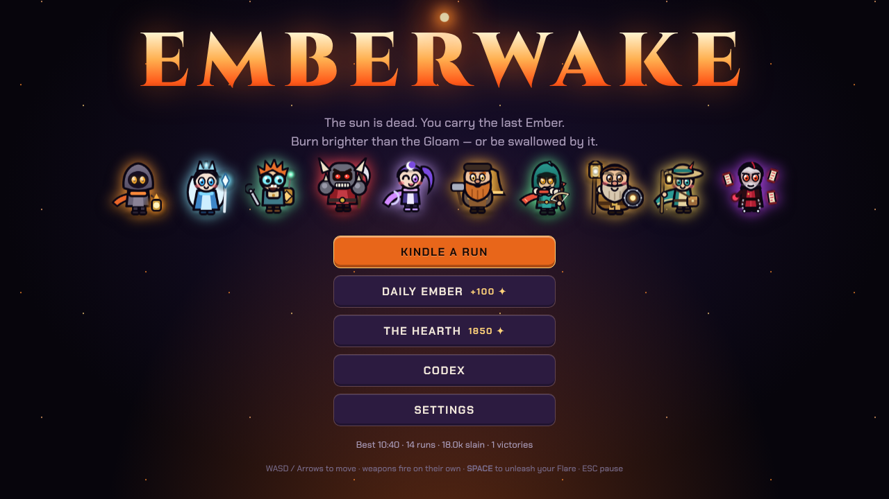

## Contents
- [How a run works](#how-a-run-works) · [What makes it Emberwake](#what-makes-it-emberwake)
- [Bearers](#bearers) · [Weapons, Ascensions and relics](#weapons-ascensions-and-relics) · [Dark Pacts](#dark-pacts)
- [Stages](#stages) · [Enemies and bosses](#enemies-and-bosses) · [Random events and scenery](#random-events-and-scenery)
- [Progression](#progression) · [Difficulty](#difficulty) · [Controls](#controls) · [Mobile](#mobile)
- [Audio](#audio) · [Development](#development) · [Balance bots](#balance-bots) · [Quality gates](#quality-gates)

## How a run works
1. **Pick a Bearer and a stage**, and optionally a Heat level, a difficulty and a Keepsake.
2. **Move; everything else is automatic.** Your starting weapon fires on its own. Defeated foes drop gems; collect them to level up.
3. **Draft.** Each level-up offers a choice of weapon upgrades, passive relics, and now and then a risky Dark Pact. You hold up to six weapons and six relics, and you can reroll, banish or skip cards.
4. **Open chests.** Elites, bosses, shrines and thieves drop chests. They are bronze, silver or gold by contents, violet when an Ascension is ready, each with a light beam you can see from across the screen. Opening one builds anticipation with a quickening heartbeat before the reveal.
5. **Ascend.** Bring two partner weapons to max level, open a chest, and they fuse into one Ascended weapon, *freeing a slot*.
6. **Complete the stage objective, then break the Tyrant.** Every stage has one visible goal (kindle waystones, quench forges, carry a flame, drain pools, escort an Acolyte, slay Sun-Bearers, light far waymarks, hold a lighthouse). It sits in a block at the bottom of the screen with a progress bar, and arrows point at it. Until it is done the Eclipse Tyrant is **warded** and cannot be killed: no blind runs.
7. **Survive the boss timeline.** The Brood Matron at 5:00, the Cinder Colossus at 10:00, the Gloam Herald at 12:30 and the **Eclipse Tyrant at 15:00**. Kill the Tyrant to win, then bank the victory or keep burning in Endless mode... until the **Hollow** comes for you.
8. **Bank your cinders** at the Hearth for permanent upgrades and new Bearers; new stages open as you complete objectives. Then go again.

| Level-up draft | Opening a chest |
|---|---|
| 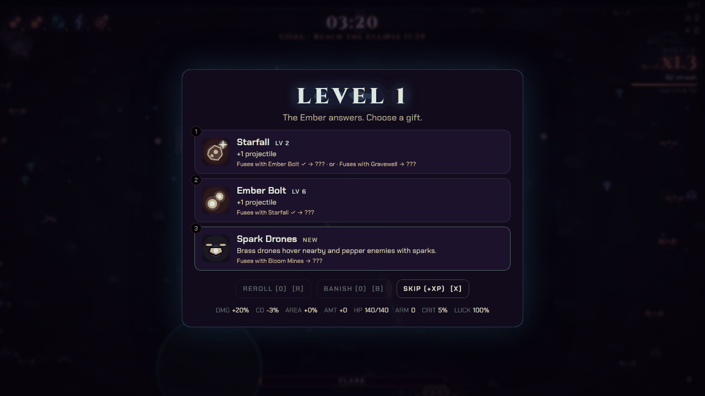 | 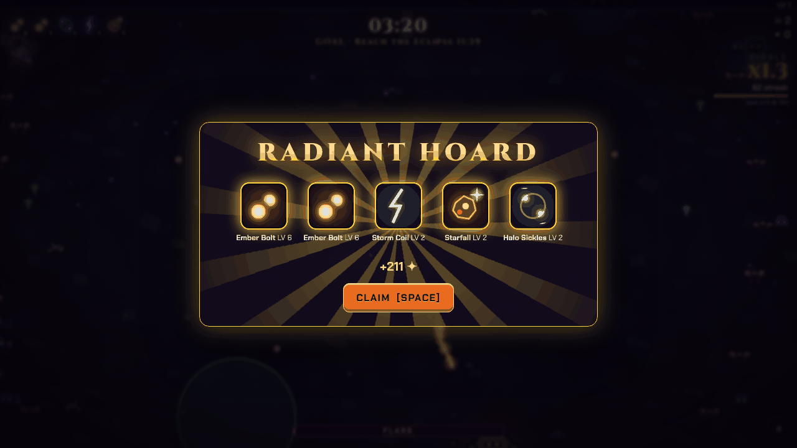 |

## What makes it Emberwake
- **Kindle** — kills feed a streak multiplier (up to x2.5 cinders, half-strength XP bonus). Stop killing and it gutters out. First reaching tiers 3, 4 and 6 in a run also drops a Flare charge, a Magnet and a Chest.
- **Flare** — each Bearer has a unique ultimate charged by kills (SPACE / gamepad A / touch button).
- **Ascension** — two max-level partner weapons fuse at a chest into one Ascended weapon, *freeing a slot*.
- **Dark Pacts** — rare draft cards that trade danger for permanent power.
- **Totems** — breakable obelisks hiding magnets, bombs, frost, healing and flare charge.
- **Overcharge** — once everything is maxed, every level-up auto-applies stacking power. Forever.
- **Gloam Pressure** — erase the horde faster than it arrives and the dark pushes harder, so a god-tier build always has a tide to carve through.
- **The Gloam settles** — stand still and the dark closes in: after a few seconds of near-stillness it drains a share of your max health that armor cannot stop, smothers healing and draws a crowd. No build, however strong, can win by idling (shrines, healing springs and hearths are exempt). Verified with a motionless bot at full strength: dead in about 38 seconds, every time.
- **Soft obstacles** — pillars, tombs, crystals and trees resist you (you slide along them, or wade through at a fraction of your speed) but never wall you in; mud and dunes drag at your heels; Ashfield vents erupt after a warning. Enemies pass through scenery, as in Vampire Survivors.
- **Signature perks** — every Bearer has a passive perk beyond their stats (longer Kindle, dodge, bell toll, Marked Prey, Hearthheart...).
- **Random events** — healing springs, meteor showers with telegraphed impacts, Blood Moons, Ember Thieves running off with a chest, stampedes and rings of enemies closing in.
- **Readable battlefield** — scenery is dimmed and low-contrast; drops glow; elites and bosses carry coloured halos; chests beam.
- **The Hearth** — spend cinders on permanent upgrades, new Bearers, and the endless **Eternal Embers**.
- **Heat** — win a stage to unlock the next Heat level (up to 10): tougher, faster, denser runs that pay more cinders.
- **Difficulty setting** — Easy / Normal / Hard / Brutal: harder runs pay more cinders and XP, easier runs pay less.
- **Feats** — 16 achievements that pay cinders, with live unlock banners.
- **Daily Ember** — a fixed, shared setup that changes every day.
- **Stage objectives** — each stage asks something different of you (see [Stages](#stages)), kept visible on the HUD.
- **Seals and Keepsakes** — five lasting marks per stage (Dawn, Swift, Ember, Iron, Fellowship) pay cinders once; a stage's Dawn Seal also unlocks its **Keepsake**, a small capped perk you can carry into any run.
- **Shifting lands** — on the Wayfarer's March the world changes biome as you travel: frost to the north, ash to the east, glass dunes to the south, marsh to the west. The ground, scenery, hazards and enemies all blend gradually.
- 10 Bearers, 15 weapons, 8 Ascensions, 17 relics, 6 Dark Pacts, 14+ enemy types, 4 bosses plus the Hollow, 8 stages, Endless mode.

## Bearers
Each Bearer starts with a different weapon, bonus, Flare and perk. Later Bearers unlock at the Hearth for cinders **and** an accomplishment.

| Bearer | Weapon | Bonus | Flare | Perk |
|---|---|---|---|---|
| **Kael**, the Ashen Warden | Ember Bolt | +10% damage | **Supernova** — a colossal ring of fire | **Slow Burn** — Kindle lasts 35% longer |
| **Ysolde**, the Rime Oracle | Rime Pulse | +15% area, +10% duration, +15% damage | **Absolute Zero** — freeze every enemy; frozen foes shatter for double damage | **Rime Heart** — foes that die frozen charge your Flare 2.5x faster |
| **Pip**, the Clockwork Tinker | Spark Drones | -10% cooldowns, +15% projectile speed | **Overclock** — all weapons fire 3x faster | **Salvage** — every 40s a gadget drops (magnet, bomb, stillwater, flare orb) |
| **Grahm**, the Blood Reaver | Crescent Arc | +40 health, +1 armor, +0.5 regen | **Bloodrage** — double damage, +30% speed, lifesteal | **Bloodthirst** — every kill heals a little |
| **Lune**, the Moon Dancer | Moonglaive | +20% move speed, +20% luck | **Moonfall** — twelve glaives spiral out, then you blink untouchable | **Moonstep** — 14% chance to slip any hit; longer invulnerability after being struck |
| **Brannoc**, the Bellwright | Gravewell | +25% max health, +15% area, -10% move speed | **Great Toll** — every foe on screen stunned and struck by three rings of sound | **Tollbearer** — every 15s the bell tolls, hurling nearby foes away |
| **Sable**, the Gloam Hunter | Rime Lance | +15% crit chance, +35% crit damage, +20% damage | **Deadeye** — every strike crits and projectiles fly faster | **Marked Prey** — +35% damage to elites and bosses |
| **Orin**, the Hearthkeeper | Sunring | +30% health, +1.2 regen, +30% area, +15% damage, -5% move speed | **Hearthfire** — plant a roaring hearth that burns foes and mends you | **Hearthheart** — every level-up restores 20% health |
| **Wren**, the Wayfarer | Prism Beam (starts at level 2) | +10% move speed, +25% pickup radius, +10% damage | **Lantern Road** — sprint 40% faster for 8s, trailing burning lanterns | **Stride** — +12% damage while moving |
| **Mordrel**, the Pactbound | Storm Coil | +20% damage, +20 health | **Debt Called** — a ring of ruin that grows with each sworn Pact and mends you for each | **Debtor** — four Pact slots, +8% damage per Pact sworn |

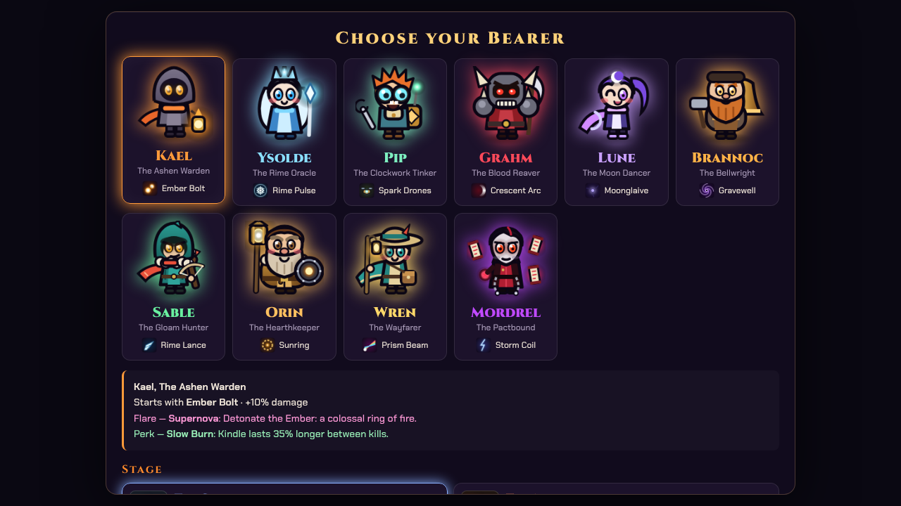

On phones the Bearer and stage pickers are swipeable strips, the Begin row stays pinned at the bottom, and picking something no longer scrolls you back to the top.

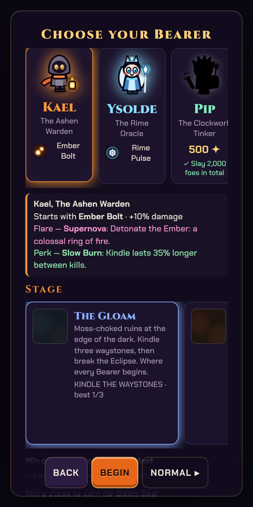

## Weapons, Ascensions and relics

**15 weapons**, each with 8 levels: Ember Bolt (seeking fireballs), Halo Sickles (orbiting blades), Storm Coil (chain lightning), Rime Pulse (freezing shockwave), Wisp Swarm (hunting wisps), Crescent Arc (sweeping cleave), Starfall (meteors), Moonglaive (returning glaive), Prism Beam (rotating beams), Bloom Mines (volatile blossoms), Spark Drones (hovering sparkers), Sunring (flame aura), Rime Lance (piercing icicles), Gravewell (vortex that implodes), Sanctum Quills (radial quills).

**8 Ascensions** — max out both parents, open a chest, and they become one stronger weapon:

| Ascension | Recipe | Effect |
|---|---|---|
| Cataclysm Comet | Ember Bolt + Starfall | Fireballs detonate on impact and the sky never stops falling |
| Thousand Edges | Halo Sickles + Crescent Arc | An eternal storm of blades and a cleave that hits all around |
| Tempest Heart | Storm Coil + Rime Pulse | Every frozen pulse crackles with chain lightning |
| Seraph Choir | Wisp Swarm + Prism Beam | Endless prismatic beams and wisps that burst into light |
| Eclipse Disc | Moonglaive + Sunring | Black-sun glaives orbit inside a blazing corona |
| Hive Foundry | Bloom Mines + Spark Drones | A drone wing that seeds the ground with blossoms |
| Glacier Spire | Rime Lance + Sanctum Quills | Radiant ice erupts in every direction, freezing solid |
| Event Horizon | Gravewell + Starfall | Vortices drag the horde into a knot while the sky falls on it |

**17 relics** (up to 5 levels each): Ember Heart (damage), Quicksilver (cooldowns), Wide Lens (area), Gale Feather (projectile speed), Echo Shard (+1 projectile; weapons without projectiles gain damage and area instead), Iron Root (health), Living Moss (regen), Wind Boots (move speed), Lodestone (pickup radius), Lucky Bone (luck), Hawk Eye (crit), Hourglass (duration), Bark Plate (armor), Sage Tome (XP), Gilded Tooth (cinders), Ember Reservoir (Flare charge), Thorn Mail (reflects melee hits).

## Dark Pacts
Rare, risky draft cards (up to three per run): **Hunger** (more spawns, more damage and XP), **Glass** (less health, much more damage), **Frenzy** (faster enemies, faster you), **Avarice** (tougher enemies, double cinders), **the Wick** (enemies hit harder, +1 revival) and **Ashes** (no healing pickups, +1 projectile).

## Stages
Each stage has its own ground, scenery, music, enemy mix and cinder multiplier. Harder stages pay more.

| Stage | Flavour | Objective |
|---|---|---|
| **The Gloam** | Moss-choked ruins at the edge of the dark. Where every Bearer begins. | **Kindle three waystones**: stand in each ring for five seconds while a ring of foes closes in. |
| **The Ashfields** | Scorched plains where husks and ram beetles stampede; basalt, stumps and erupting vents. | **Quench four Cinder Forges** that keep breeding imps while you are near. |
| **The Rimewood** | A frozen forest where wraiths and frost wisps drift between the trees. | **Carry the Heartflame** from the Hearthstone to four braziers. The flame gutters out if you stray, and the cold bites while you hold it. |
| **The Drowned Marsh** | A black bog where lurkers sink and surface at your heels; mud and reeds slow you. | **Drain six rot pools** that grow while ignored; channel each one while lurkers rise. |
| **The Shattered Reliquary** | A drowned cathedral of tombs and guttering candles; Candle Acolytes keep their vigil. | **Escort the Last Acolyte** through three chapels; it only walks while you stay close. |
| **The Glass Dunes** | Sun-fused wastes where Glass Scarabs scatter like sparks; sand drifts drag at your heels. | **Gather seven sun-shards** from fleeing golden Sun-Bearers (and bosses); each shard fades in 20 seconds. |
| **The Wayfarer's March** | An endless road: frost to the north, ash to the east, glass dunes to the south, marsh to the west. The land blends from one to the next as you walk, and each biome brings its own scenery, hazards and monsters. | **Light four far waymarks** placed across the changing wilds, one in each direction. |
| **The Stormbreak Coast** | A wrecked shore under a restless sky. Gales shove you and the horde about, lightrods strike, and tide pools and kelp drag at your heels. | **Hold the lighthouse** through three sieges: keep the horde off the tower until the siege ends. |

| | | |
|---|---|---|
| 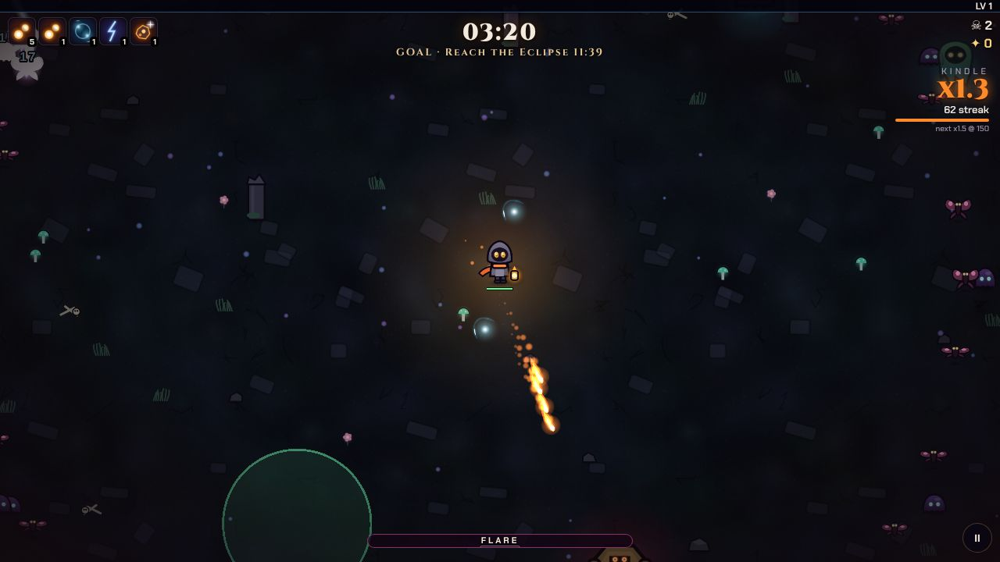 | 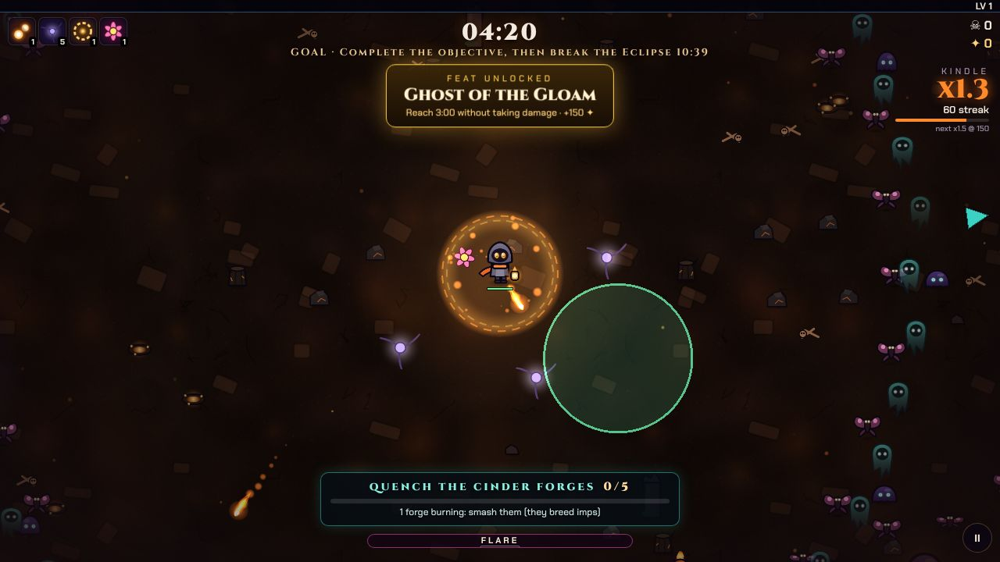 | 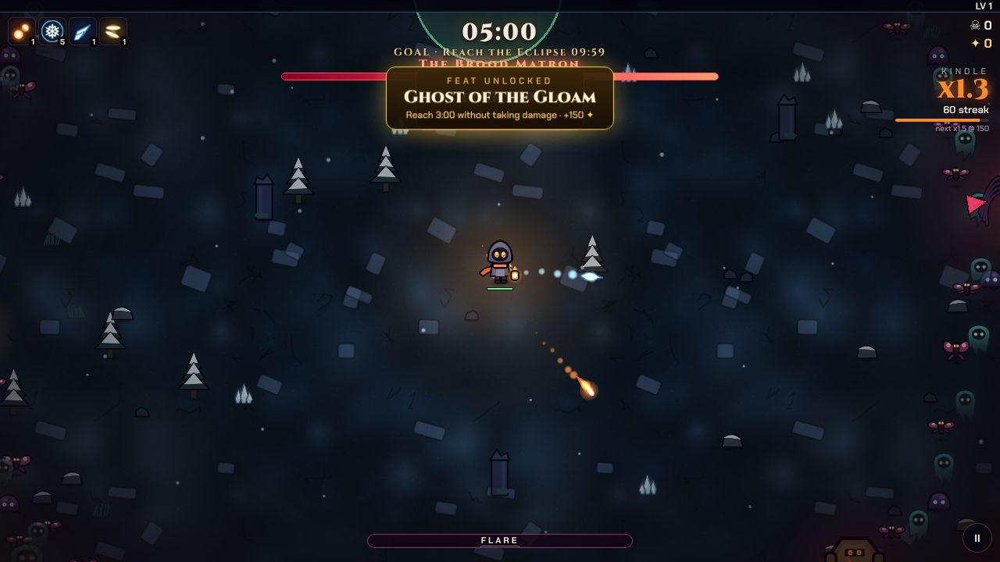 |
| 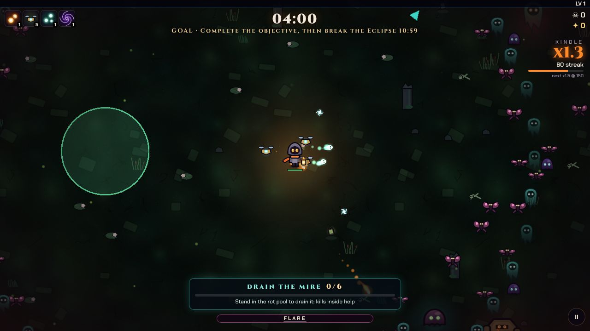 | 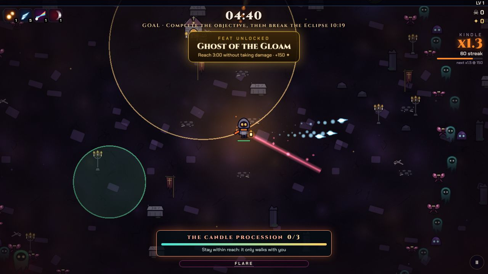 | 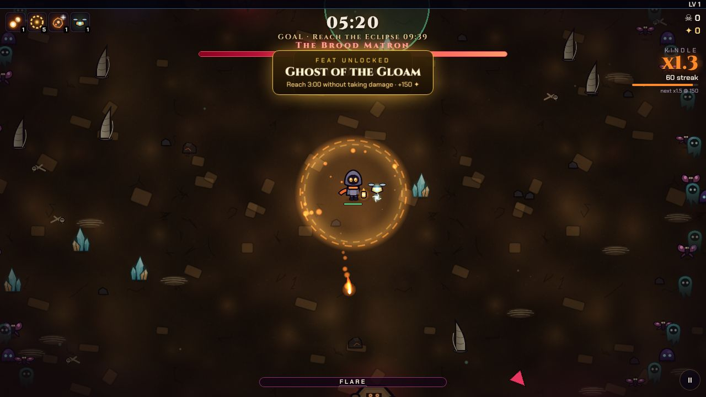 |
| 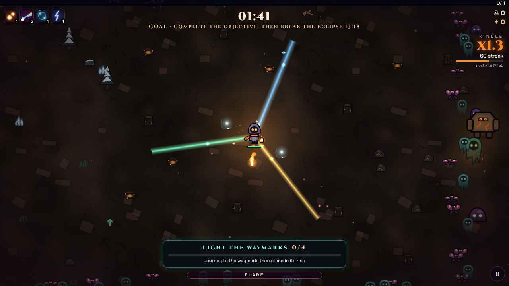 | 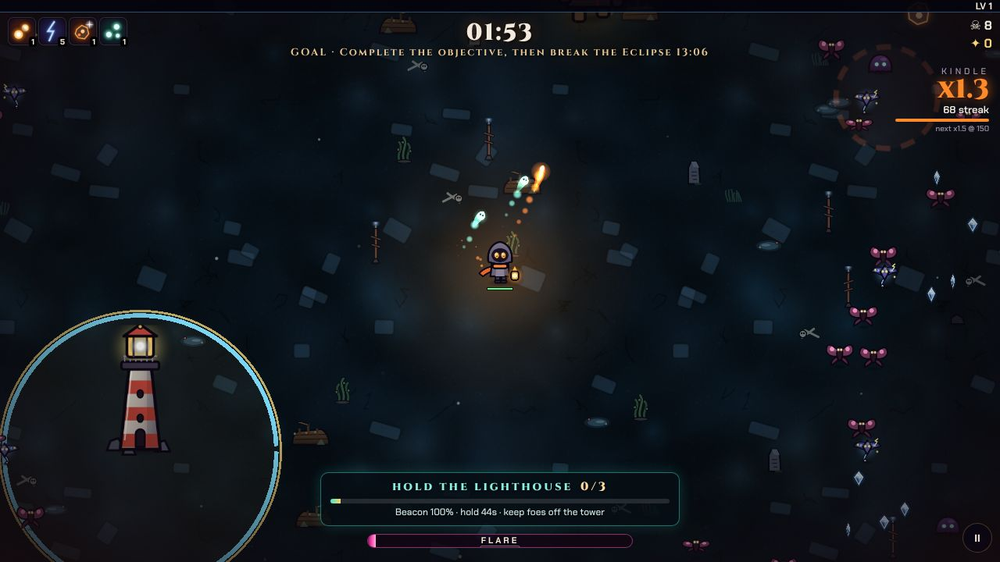 | |

The objective block at the bottom of each shot is always on screen. The March shot sits on a biome border, where frost trees and ash scenery blend; the Coast shot is the start of the first lighthouse siege.

## Enemies and bosses
Gloomlings, Dusk Moths, Husks, Wraiths, Bloaters (which burst into Broodlings), Ram Beetles (telegraphed charges), Spitters (ranged), Sentinels, plus stage specials: Cinder Imps, Frost Wisps, Mire Lurkers, Glass Scarabs, Candle Acolytes and Stormkites; objective creatures such as Cinder Forges and golden Sun-Bearers. From three minutes, elites roll **affixes**: swift, vampiric, warded or volatile.

| Boss | When | What to watch |
|---|---|---|
| The Brood Matron | 5:00 | Births a new wave every few heartbeats |
| The Cinder Colossus | 10:00 | Watch for the red ring before it slams |
| The Gloam Herald | 12:30 | Blinks and shrouds itself; strike in the moments after it erupts |
| The Eclipse Tyrant | 15:00 | Fires expanding novas. Break it and dawn bleeds through |
| The Hollow | after the Tyrant, or 18:00 | Cannot be harmed and never tires. Run |

## Random events and scenery
Rings of foes close in, stampedes rush through, **Ember Thieves** sprint away with a chest, **Blood Moons** speed everything up while doubling XP, **healing springs** bubble up, and **meteor showers** rain down on telegraphed circles that hurt you and the horde alike. Ember Shrines ask you to hold your ground for a relic chest. Scenery such as pillars, tombs, crystals and trees slows you without ever trapping you; stage hazards such as erupting vents warn before they hurt.

## Progression
- **Cinders** are the currency. You gather them in runs (plus a survival bonus and one-off **milestone bonuses** the first time you outlast 3, 6, 10 and 15 minutes on each stage) and spend them at **the Hearth**.
- **Hearth upgrades** give permanent stat bonuses (damage, health, armor, regen, cooldowns, area, speed, pickup radius, XP, cinders, luck, Flare charge, rerolls, banishes, a second projectile, revivals, a starting relic).
- **Bearers** cost cinders **and** an accomplishment (surviving a number of minutes, reaching a level, slaying a boss, winning a run...), so grinding alone never skips the game.
- **Stages are earned, never bought.** The Ashfields open as soon as you kindle one Gloam waystone; the Rimewood needs the Gloam objective; the Marsh needs the Ashfields objective; the Reliquary needs a Gloam win plus the Rimewood objective; the Glass Dunes need the Marsh and Reliquary objectives plus two stage wins; the Wayfarer's March needs three Dawn Seals; the Stormbreak Coast needs the Glass Dunes Dawn Seal. Each stage card shows what it wants.
- **Earned weapons and relics** — Wisp Swarm, Bloom Mines, Starfall, Sanctum Quills, Thorn Mail, Ember Reservoir and Echo Shard stay out of the level-up draft until you meet a goal (kills, survival time, a boss, an objective). The Codex shows each lock and what opens it.
- **Eternal Embers** — after your first win, an endless, ever-pricier sink for spare cinders with small, capped bonuses, so there is always something to work toward.
- **Heat** — each win on a stage unlocks the next of 10 Heat levels there: tougher enemies, denser hordes, more elites, weaker Overcharge, and more cinders.
- **Seals and Keepsakes** — each stage has five Seals (Dawn: win; Swift: objective done by 12:00 in a won run; Ember: win at Heat 3+; Iron: win on Hard or Brutal; Fellowship: win with three different Bearers). Each pays cinders once, and the Dawn Seal unlocks that stage's Keepsake (a small perk you can equip on any run). Earning Dawn Seals also opens the Wayfarer and the late stages.
- **Feats** — 16 one-time achievements that pay cinders.
- **Dawn skins** — win with a Bearer to unlock their Dawn variant.
- **Codex** — Ascensions, feats, records and a bestiary that fills as you meet things.

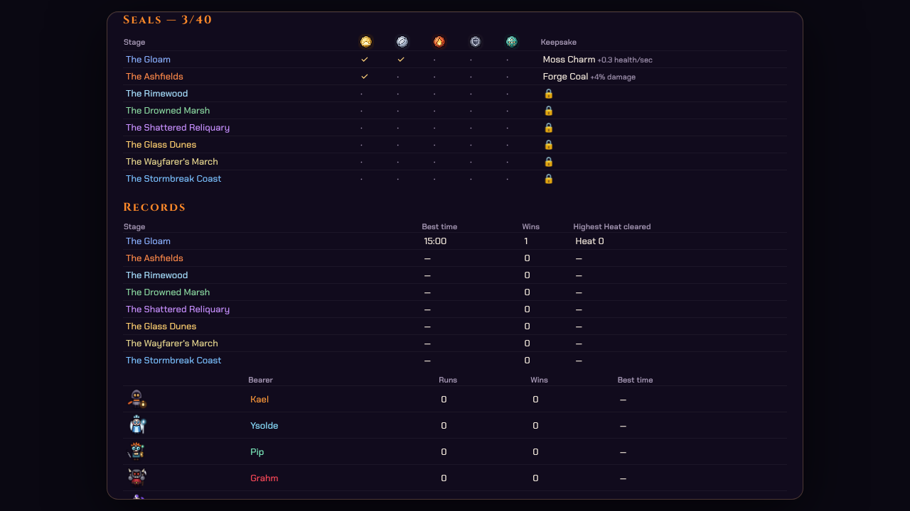

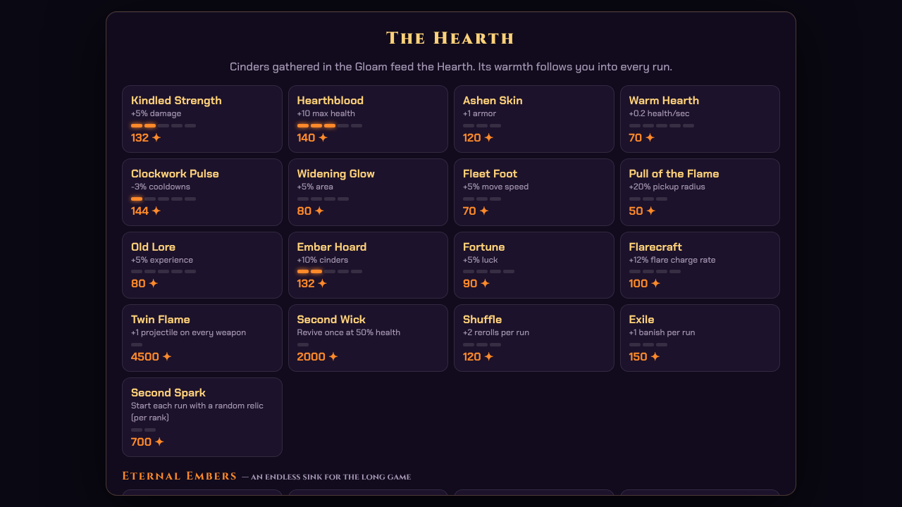

## Difficulty
Pick a difficulty in **Settings** or from the Bearer-select screen (it applies to your next run). Harder runs pay more; easier runs pay less. The Daily Ember is always played on Normal.

| Difficulty | Enemy health | Enemy damage | Horde size | Cinders | XP |
|---|---|---|---|---|---|
| Easy | x0.8 | x0.7 | x0.85 | x0.6 | x0.8 |
| Normal | x1 | x1 | x1 | x1 | x1 |
| Hard | x1.45 | x1.4 | x1.2 | x1.6 | x1.1 |
| Brutal | x1.9 | x1.75 | x1.4 | x2.4 | x1.2 |

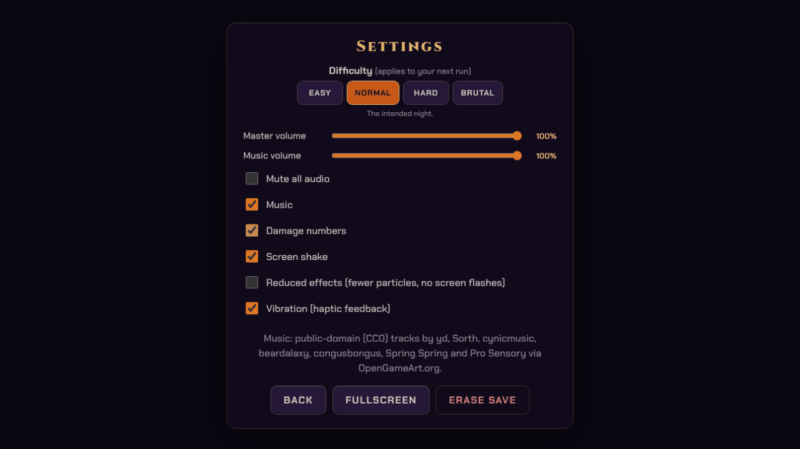

## Controls
| | Move | Flare | Pause | Draft |
|---|---|---|---|---|
| **Keyboard** | WASD / arrows | SPACE | ESC or P | 1–4 pick · R reroll · B banish · X skip |
| **Touch** | Drag anywhere (floating stick) | ✹ button | II button | Tap |
| **Gamepad** | Left stick / D-pad | A or RB | Start | D-pad + A |

## Mobile
Emberwake is built to be played on a phone: a floating joystick that follows your thumb, large Flare and Pause buttons, safe-area handling for notches, keyboard hints replaced with touch hints, optional vibration, a screen wake lock during runs, a fullscreen button, short-landscape layouts and a lower render scale on high-density screens.

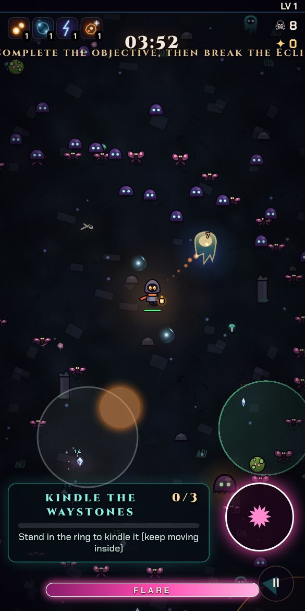

Comfort options in Settings: master and music volume, mute, damage numbers, screen shake, a reduced-effects mode (fewer particles, no flashes) and vibration. Reduced-motion system settings are respected.

## Audio
- **Music** — recorded **CC0** tracks give each stage, the menu and the boss fights their own tone (see [`public/music/CREDITS.txt`](public/music/CREDITS.txt) for authors and links). If a track cannot load, a generative score takes over: per-stage themes, an A-A-B-C song form with an echoing counter-melody, and boss and Hollow layers.
- **Sound effects** — all synthesised live with the Web Audio API: hits, crits, a distinct Flare for each Bearer, chest build-up and burst, shrine, ascension, revive, Hollow and more.

## Development
```bash
npm install
npm run dev     # local dev server
npm run build   # static build in dist/ (relative paths, GitHub Pages ready)
npm run lint    # ESLint + Stylelint + html-validate, all with --max-warnings 0
```
Layout: `src/game.js` (simulation and rendering), `src/weapons.js` (weapon behaviours), `src/data.js` (all content data), `src/tuning.js` (global balance knobs), `src/atlas.js` (procedural sprites), `src/audio.js` (SFX, music), `src/ui.js` and `src/style.css` (menus and HUD), `src/input.js` (keyboard, gamepad, touch), `src/devsim.js` (dev-only bots).

In `npm run dev` the console exposes a headless simulator: `await __sim(900, 'warden', { skill: 'average' })` runs the real game loop with a bot and reports level curve, kills, cinders earned and what killed you.

## Balance bots
`npm run balance` drives bots of four graded skill levels (**novice, average, skilled, expert**) through full runs in parallel headless browsers and prints win rate, survival time, level and cinder income per cell, so difficulty and the economy can be tuned against numbers instead of feel.
```bash
npm run dev &          # the harness talks to the dev server
npm run balance -- --url http://localhost:5173 --runs 8 --skills novice,average,skilled,expert \
  --chars warden --stages gloam --difficulty normal --meta 0 --heat 0 --secs 1000 --workers 4
# override balance knobs per run, no code edits needed:
npm run balance -- --runs 8 --tune xp=0.5,enemyDmg=1.3,spawn=1.1
```
### What the bots say about the shipped balance
Measured on the Gloam as Kael at Normal difficulty (win rate over 6-10 seeded runs per cell; bots stay noisy, so read the shape, not single numbers):

| Hearth progress (share of total cost spent) | Average bot | Skilled bot |
|---|---|---|
| none | ~20% wins, dies ~12-16 min otherwise | ~30% |
| 30% | ~40% | ~60-100% |
| 60% | ~60% | ~60-90% |
| everything | ~75% | ~90% |

With stage objectives on (bots pursue them), the later stages measured at 30% Hearth progress: Ashfields about 13% for both average and skilled bots (objective done in ~90-100% of runs), Glass Dunes 0% average / 25% skilled, Stormbreak Coast and Wayfarer's March roughly 0-20% average and 15-65% skilled. The Gloam stays at 50-75%. Late stages are meant to be hard without Hearth upgrades and Heat.

New Bearers on the Gloam (20 runs each, 30% Hearth): Kael ~46% average / ~100% skilled, Wren ~35% / ~75%, Mordrel ~45% / ~90%.

Novice bots die around 5-9 minutes with no upgrades. Harder stages, Hard (+1 level of difficulty) and Brutal pull these numbers down in order; Easy lifts them. Typical income per run at no upgrades is about 150 cinders for a novice, 750 for an average run and 1,200-1,900 for a win, so the first Bearer comes in a run or two and the whole catalogue takes dozens of runs, with Eternal Embers beyond. `--stand` runs a motionless bot to prove idling can never win.

Bots steer only through the same input path as a player and use a direction-sampling dodger whose awareness, reaction time, lookahead, drafting and Flare timing scale with skill. Knobs live in [`src/tuning.js`](src/tuning.js). Sims run without particles and at a 0.05 s step (0.1 s makes bots noticeably weaker; do not go to 0.2) so a full 15-minute run takes about a minute. See the script header for all options.

## Quality gates
- **CI** (`.github/workflows/ci.yml`) runs on every push and PR: ESLint, Stylelint and html-validate with warnings treated as errors, a production build, and a check that dev-only hooks never ship.
- **Deploy** (`.github/workflows/deploy.yml`) lints before building and publishing to GitHub Pages on push to `main`.
- **Dependabot** (`.github/dependabot.yml`) opens weekly grouped updates for npm and GitHub Actions.

## Credits
Code, sprites and sound effects: this repository. Music: public-domain (CC0) tracks by yd, Sorth, cynicmusic, beardalaxy, congusbongus, Spring Spring and Pro Sensory via [OpenGameArt.org](https://opengameart.org). Fonts: Cinzel and Chakra Petch (Google Fonts, OFL).
